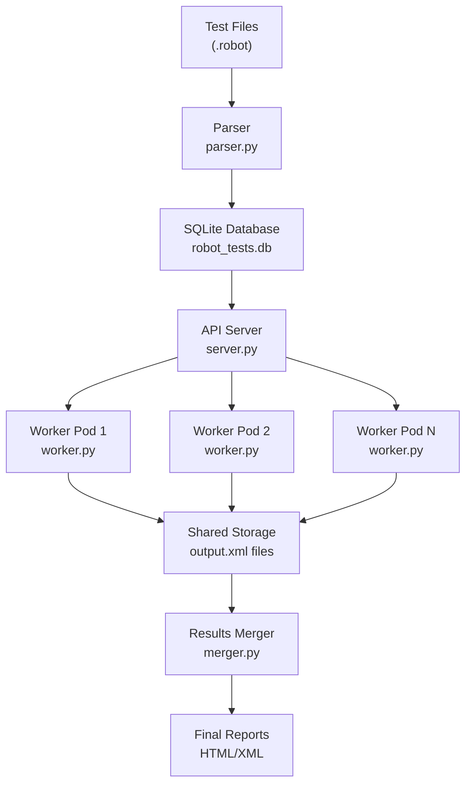

# Robot Framework Parallel Test Suite

A Kubernetes-native solution for executing Robot Framework tests at scale with distributed parallel execution, centralized coordination, and comprehensive result aggregation.

## 🚀 Quick Start

```bash
# 1. Parse test files and create database
python parser.py ./tests

# 2. Deploy to Kubernetes with 5 worker pods
./deploy.sh --replicas 5

# 3. Monitor execution
kubectl get pods -n robot-tests -w

# 4. Check progress
curl http://localhost:8000/api/status
```

## ✨ Features

- **🔄 Parallel Execution**: Scale test execution across multiple Kubernetes pods
- **📊 Centralized Coordination**: API-based test distribution with database state management
- **🛡️ Fault Tolerance**: Automatic retry mechanisms and graceful failure handling
- **📈 Real-time Monitoring**: Live progress tracking and detailed execution logs
- **📋 Comprehensive Reporting**: Automatic result merging with HTML report generation
- **⚡ High Performance**: Optimized for large test suites with thousands of tests

## 🏗️ Architecture Overview



## 📁 Project Structure

```
dummy-test-suite/
├── docs/                    # 📚 Comprehensive documentation
│   ├── README.md           # Documentation index
│   ├── architecture.md     # System architecture and design
│   ├── deployment-guide.md # Step-by-step deployment instructions
│   └── api-reference.md    # Complete API documentation
├── tests/                   # 🧪 Robot Framework test suites
│   ├── T01/                # Test suite 01 - Basic tests
│   ├── T02/                # Test suite 02 - Mathematical operations
│   ├── T03/                # Test suite 03 - Collections and data
│   ├── T04/                # Test suite 04 - HTTP and API testing
│   └── T05/                # Test suite 05 - File operations
├── parser.py               # 🔍 Test parser and database creator
├── server.py               # 🌐 API server for test coordination
├── worker.py               # 👷 Worker pod test executor
├── merger.py               # 📋 Results merger and report generator
├── deploy.sh               # 🚀 Deployment automation script
├── run.sh                  # 🏃 Local test execution script
├── Dockerfile              # 🐳 Container image definition
├── worker-deployment.yaml  # ☸️ Kubernetes deployment configuration
└── requirements.txt        # 📦 Python dependencies
```

## 📖 Documentation

Visit the [`docs/`](./docs/) directory for comprehensive documentation:

- **[Architecture Guide](./docs/architecture.md)**: Complete system design, workflows, and technical details
- **[Deployment Guide](./docs/deployment-guide.md)**: Step-by-step deployment instructions and configuration
- **[API Reference](./docs/api-reference.md)**: Complete REST API documentation with examples

## 🛠️ Prerequisites

- **Kubernetes**: minikube (local) or any Kubernetes cluster
- **Docker**: For building container images
- **kubectl**: Kubernetes command-line tool
- **Python 3.11+**: For local development

## ⚡ Usage Examples

### Basic Deployment
```bash
./deploy.sh --replicas 5
```

### High-Scale Deployment
```bash
./deploy.sh --replicas 20 --reset
```

### Development Mode with Cleanup
```bash
./deploy.sh --replicas 3 --cleanup
```

### Monitor Execution
```bash
# Watch pods
kubectl get pods -n robot-tests -w

# Check API status
curl http://localhost:8000/api/status | jq

# View worker logs
kubectl logs -l app=robot-test-runner -n robot-tests -f
```

## 📊 Monitoring and Observability

### Real-time Status
```bash
# Get comprehensive status
curl http://localhost:8000/api/status

# Check completion percentage
curl -s http://localhost:8000/api/status | jq '.execution_summary.completion_percentage'
```

### Pod Monitoring
```bash
# Check all pods status
kubectl get pods -n robot-tests

# Describe pod details
kubectl describe pod <pod-name> -n robot-tests

# View logs with timestamps
kubectl logs <pod-name> -n robot-tests --timestamps
```

## 🔧 Configuration

### Environment Variables

| Variable | Default | Description |
|----------|---------|-------------|
| `API_BASE_URL` | `http://test-api-service:8000` | API server endpoint |
| `REPLICAS` | `5` | Number of worker pods |
| `TESTS_DIR` | `/tests` | Test files directory |
| `SHARED_OUTPUTS_DIR` | `/shared-outputs` | Shared output storage |
| `POLLING_INTERVAL` | `10` | Status polling interval (seconds) |

### Deployment Options

| Flag | Description | Example |
|------|-------------|---------|
| `--replicas N` | Set number of worker pods | `--replicas 10` |
| `--reset` | Reset test statuses to pending | `--reset` |
| `--cleanup` | Auto-cleanup and merge results | `--cleanup` |

## 🧪 Test Suites Included

The project includes comprehensive test suites demonstrating various Robot Framework capabilities:

- **T01**: Basic string operations and file system tests
- **T02**: Mathematical operations and comparisons
- **T03**: List and dictionary operations
- **T04**: HTTP API testing with RequestsLibrary
- **T05**: File operations and string manipulations

Each suite contains both passing and failing tests to demonstrate proper error handling and reporting.

## 🚀 Performance and Scaling

### Recommended Scaling Guidelines

| Test Suite Size | Recommended Replicas | Expected Runtime |
|-----------------|---------------------|------------------|
| < 50 tests | 3-5 pods | 2-5 minutes |
| 50-200 tests | 5-10 pods | 5-10 minutes |
| 200-1000 tests | 10-20 pods | 10-20 minutes |
| > 1000 tests | 20+ pods | 20+ minutes |

### Resource Requirements

```yaml
# Per worker pod
resources:
  requests:
    memory: "256Mi"
    cpu: "250m"
  limits:
    memory: "512Mi"
    cpu: "500m"
```

## 🛠️ Development

### Adding New Tests
1. Create `.robot` files in the `tests/` directory
2. Run parser: `python parser.py ./tests`
3. Redeploy: `./deploy.sh --replicas 5`

### Local Development
```bash
# Parse tests locally
python parser.py ./tests --list

# Run API server locally
python server.py

# Execute single test
python run.sh T01_01
```

### Custom Extensions
- Modify `worker.py` for custom test execution logic
- Update `merger.py` for custom result processing
- Extend `server.py` for additional API endpoints

## 🐛 Troubleshooting

### Common Issues

**Pods stuck in Pending:**
```bash
kubectl describe nodes  # Check resource availability
kubectl describe pod <pod-name> -n robot-tests
```

**Database connection errors:**
```bash
kubectl logs -l app=test-api -n robot-tests
```

**Network connectivity issues:**
```bash
kubectl exec -it <worker-pod> -n robot-tests -- \
  curl http://test-api-service:8000/api/status
```

See the [Deployment Guide](./docs/deployment-guide.md) for comprehensive troubleshooting information.

## 🧹 Cleanup

### Complete Cleanup
```bash
kubectl delete namespace robot-tests
pkill -f "kubectl port-forward"
```

### Reset Tests Only
```bash
curl -X POST http://localhost:8000/api/reset
```

## 📄 License

This project is licensed under the MIT License - see the LICENSE file for details.

## 🤝 Contributing

1. Fork the repository
2. Create a feature branch: `git checkout -b feature/new-feature`
3. Make changes and test thoroughly
4. Update documentation as needed
5. Submit a pull request

## 📞 Support

- **Documentation**: See [`docs/`](./docs/) directory
- **Issues**: Submit GitHub issues with detailed information
- **Debugging**: Use the troubleshooting guides in documentation

---

**Start exploring with the [Architecture Guide](./docs/architecture.md) or jump straight to deployment with the [Deployment Guide](./docs/deployment-guide.md)!**
