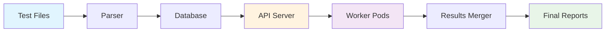

# Documentation

Welcome to the Robot Framework Parallel Test Suite documentation. This directory contains comprehensive guides and architectural documentation for understanding, deploying, and maintaining the distributed test execution system.

## 📚 Documentation Index

### [Architecture Documentation](./architecture.md)
Complete technical overview of the system architecture, including:
- **System Components**: Parser, API Server, Worker Pods, Results Merger
- **Workflow Diagrams**: Visual representation using Mermaid diagrams
- **Database Schema**: Complete table structures and relationships
- **Process Flow**: Detailed sequence diagrams for each execution phase
- **Technology Stack**: Tools and frameworks used throughout the system

### [Deployment Guide](./deployment-guide.md)
Step-by-step instructions for deploying the system, including:
- **Prerequisites**: System requirements and dependencies
- **Quick Start**: Get up and running in minutes
- **Configuration Options**: Customization parameters and environment variables
- **Troubleshooting**: Common issues and debugging techniques
- **Production Considerations**: Scaling, security, and monitoring

## 🏗️ System Overview

The Robot Framework Parallel Test Suite is a Kubernetes-native solution for executing Robot Framework tests at scale. The system distributes test execution across multiple pods while maintaining centralized coordination and result aggregation.

### Key Features

- **🚀 Parallel Execution**: Scale test execution horizontally across multiple Kubernetes pods
- **📊 Centralized Coordination**: API-based test distribution with database-backed state management
- **🔄 Fault Tolerance**: Automatic retry mechanisms and graceful failure handling
- **📈 Real-time Monitoring**: Live progress tracking and detailed execution logs
- **📋 Comprehensive Reporting**: Automatic result merging with HTML report generation

### Architecture at a Glance



## 🚀 Quick Start

1. **Parse Tests**: `python parser.py ./tests`
2. **Deploy System**: `./deploy.sh --replicas 5`
3. **Monitor Progress**: `kubectl get pods -n robot-tests -w`
4. **Retrieve Results**: Automatic with `--cleanup` flag

## 📖 Document Structure

### Architecture Documentation
- **Component Overview**: Detailed description of each system component
- **Data Flow**: How information moves through the system
- **Database Design**: Schema and relationships
- **Kubernetes Resources**: Pod specifications and configurations
- **Performance Characteristics**: Scalability and resource considerations

### Deployment Guide
- **Environment Setup**: Prerequisites and initial configuration
- **Step-by-Step Deployment**: Complete deployment process
- **Configuration Reference**: All available parameters and options
- **Monitoring and Debugging**: Tools and techniques for system observation
- **Maintenance Procedures**: Updates, scaling, and cleanup operations

## 🔧 Quick Reference

### Common Commands

```bash
# Parse tests and create database
python parser.py ./tests

# Basic deployment
./deploy.sh --replicas 5

# Deploy with reset and cleanup
./deploy.sh --replicas 10 --reset --cleanup

# Check system status
kubectl get pods -n robot-tests
curl http://localhost:8000/api/status

# Scale workers
kubectl scale deployment robot-test-runner --replicas=20 -n robot-tests

# Clean up
kubectl delete namespace robot-tests
```

### Key Endpoints

| Endpoint | Method | Purpose |
|----------|--------|---------|
| `/api/next_test` | GET | Get next available test |
| `/api/update_test` | POST | Report test completion |
| `/api/status` | GET | Get execution status |
| `/api/reset` | POST | Reset all test statuses |

### Environment Variables

| Variable | Default | Purpose |
|----------|---------|---------|
| `API_BASE_URL` | `http://test-api-service:8000` | API server endpoint |
| `REPLICAS` | `5` | Number of worker pods |
| `TESTS_DIR` | `/tests` | Test files location |
| `SHARED_OUTPUTS_DIR` | `/shared-outputs` | Output file storage |

## 🛠️ Development and Customization

### Adding New Test Suites
1. Place `.robot` files in the `tests/` directory
2. Run parser to update database: `python parser.py ./tests`
3. Redeploy system to pick up new tests

### Modifying Worker Behavior
- Edit `worker.py` for custom test execution logic
- Rebuild Docker image: `docker build -t dummy-test-suite:latest .`
- Redeploy workers: `kubectl rollout restart deployment/robot-test-runner -n robot-tests`

### Custom Result Processing
- Modify `merger.py` for custom result aggregation
- Add custom report formats or integrations
- Update deployment configuration as needed

## 🧪 Testing the System

### Local Testing
```bash
# Test individual components
python server.py  # Start API server locally
python worker.py  # Run worker locally
python merger.py  # Test result merging
```

### Integration Testing
```bash
# Deploy minimal system
./deploy.sh --replicas 1

# Run specific test suite
kubectl exec -it <worker-pod> -n robot-tests -- \
  robot --test "T01_01*" /tests
```

## 📝 Contributing

When contributing to the documentation:

1. **Keep diagrams up to date**: Update Mermaid diagrams when architecture changes
2. **Add examples**: Include practical examples for new features
3. **Update quick reference**: Ensure commands and endpoints are current
4. **Test instructions**: Verify all documented procedures work as described

## 🔗 Related Resources

- [Robot Framework Documentation](https://robotframework.org/robotframework/)
- [Kubernetes Documentation](https://kubernetes.io/docs/)
- [Flask API Documentation](https://flask.palletsprojects.com/)
- [Docker Documentation](https://docs.docker.com/)
- [Mermaid Diagram Syntax](https://mermaid-js.github.io/mermaid/)

## 📞 Support

For questions, issues, or contributions:

1. Check the troubleshooting sections in the deployment guide
2. Review system logs using the debugging commands provided
3. Consult the architecture documentation for technical details
4. Submit issues with detailed system information and logs

---

*This documentation is designed to be comprehensive yet accessible. Start with the quick start guide if you're new to the system, or dive into the architecture documentation for detailed technical information.*
