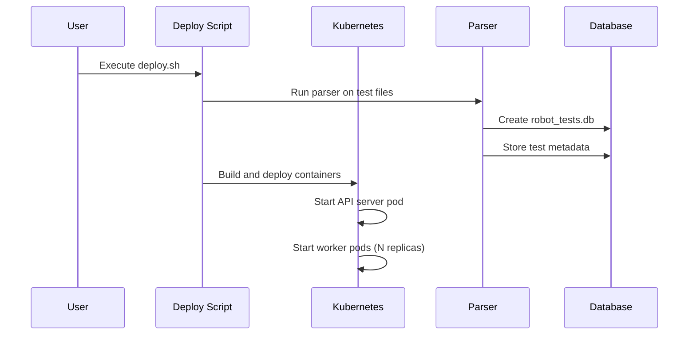
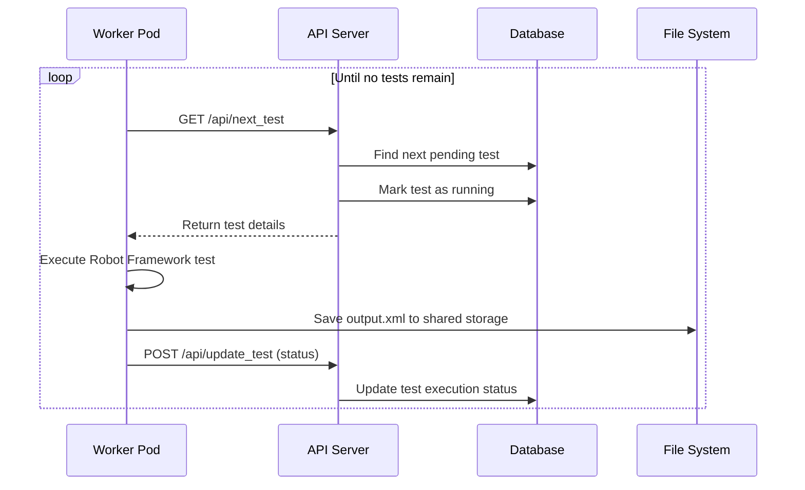
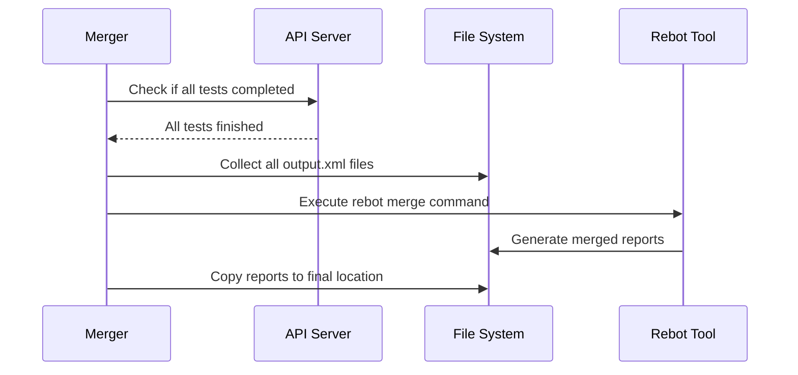

# Robot Framework Parallel Test Suite Architecture

This document explains the architecture and workflow of the distributed Robot Framework test execution system running on Kubernetes.

## Overview

The system is designed to execute Robot Framework tests in parallel across multiple Kubernetes pods, providing scalable test execution with centralized coordination and result aggregation.

## Architecture Components

### 1. Test Parser (`parser.py`)
- **Purpose**: Scans Robot Framework test files and extracts test cases
- **Input**: Directory containing `.robot` files
- **Output**: SQLite database (`robot_tests.db`) with test metadata
- **Key Functions**:
  - Parses `.robot` files using regex to extract test names
  - Creates database schema for test cases and executions
  - Stores test metadata (name, file path, suite name)

### 2. API Server (`server.py`)
- **Purpose**: Central coordination service for test distribution and status tracking
- **Technology**: Flask-based REST API
- **Database**: SQLite with thread-safe operations
- **Key Endpoints**:
  - `GET /api/next_test` - Provides next available test to worker pods
  - `POST /api/update_test` - Receives test results from workers
  - `GET /api/status` - Returns overall test execution status
  - `POST /api/reset` - Resets all test statuses to pending

### 3. Worker Pods (`worker.py`)
- **Purpose**: Execute individual Robot Framework tests
- **Deployment**: Multiple pods running in parallel
- **Workflow**:
  1. Request next test from API server
  2. Execute test using Robot Framework
  3. Store results in shared storage
  4. Report status back to API server
  5. Repeat until no tests remain

### 4. Results Merger (`merger.py`)
- **Purpose**: Combines all test results into unified reports
- **Technology**: Uses Robot Framework's `rebot` command
- **Input**: Individual `output.xml` files from worker pods
- **Output**: Merged HTML reports and XML output

### 5. Container Image (`Dockerfile`)
- **Base**: Python 3.11 slim
- **Dependencies**: Robot Framework, Flask, requests
- **Contents**: All test files, worker script, and execution tools

## System Workflow

```mermaid
graph TB
    A[Test Files<br/>(.robot)] --> B[Parser<br/>parser.py]
    B --> C[SQLite Database<br/>robot_tests.db]
    
    C --> D[API Server<br/>server.py]
    D --> E[Worker Pod 1<br/>worker.py]
    D --> F[Worker Pod 2<br/>worker.py]
    D --> G[Worker Pod N<br/>worker.py]
    
    E --> H[Shared Storage<br/>output.xml files]
    F --> H
    G --> H
    
    H --> I[Results Merger<br/>merger.py]
    I --> J[Final Reports<br/>HTML/XML]
    
    K[Deploy Script<br/>deploy.sh] --> L[Kubernetes<br/>Cluster]
    L --> D
    L --> E
    L --> F
    L --> G
    L --> I
```

## Detailed Process Flow

### Phase 1: Initialization


### Phase 2: Test Execution


### Phase 3: Results Aggregation


## Database Schema

### test_cases table
```sql
CREATE TABLE test_cases (
    id INTEGER PRIMARY KEY AUTOINCREMENT,
    test_name TEXT NOT NULL,
    file_path TEXT NOT NULL,
    suite_name TEXT NOT NULL,
    parsed_date TIMESTAMP NOT NULL,
    status TEXT DEFAULT 'pending'
);
```

### test_executions table
```sql
CREATE TABLE test_executions (
    id INTEGER PRIMARY KEY AUTOINCREMENT,
    execution_id TEXT UNIQUE NOT NULL,
    test_id INTEGER NOT NULL,
    node_id TEXT NOT NULL,
    status TEXT DEFAULT 'running',
    start_time TIMESTAMP NOT NULL,
    end_time TIMESTAMP,
    result_data TEXT,
    FOREIGN KEY (test_id) REFERENCES test_cases (id)
);
```

## Kubernetes Resources

### API Server Deployment
- **Service**: `test-api-service` (ClusterIP on port 8000)
- **Deployment**: Single replica running Flask API
- **Volumes**: Host path mount for database access

### Worker Deployment
- **Deployment**: `robot-test-runner` (configurable replicas)
- **Environment Variables**:
  - `API_BASE_URL`: Points to API service
  - `NODE_ID`: Unique pod identifier
  - `TESTS_DIR`: Location of test files
  - `RESULTS_DIR`: Local results storage
  - `SHARED_OUTPUTS_DIR`: Shared storage for output files

### Storage Configuration
- **Host Paths**: Used for development/minikube
  - `/tmp/robot-tests/`: Base directory
  - `/tmp/robot-tests/tests/`: Test files
  - `/tmp/robot-tests/shared-outputs/`: Shared output files
  - `/tmp/robot-tests/merged-results/`: Final merged results

## Key Features

### Scalability
- Horizontal scaling via Kubernetes replica count
- Lock-free test distribution using database transactions
- Parallel execution across multiple pods

### Fault Tolerance
- Database transactions prevent race conditions
- Retry mechanisms for network failures
- Graceful handling of pod failures

### Monitoring
- Real-time status via API endpoints
- Detailed execution logs per pod
- Progress tracking during test runs

### Result Management
- Individual test outputs preserved
- Automatic result merging using Robot Framework tools
- HTML reports with detailed test information

## Usage

### Basic Deployment
```bash
./deploy.sh --replicas 5
```

### With Test Reset
```bash
./deploy.sh --replicas 10 --reset
```

### With Cleanup
```bash
./deploy.sh --replicas 3 --cleanup
```

## Configuration

### Environment Variables
- `API_BASE_URL`: API server endpoint
- `REPLICAS`: Number of worker pods (default: 5)
- `POLLING_INTERVAL`: Status check interval for merger
- `SHARED_OUTPUTS_DIR`: Directory for output file storage
- `MERGED_RESULTS_DIR`: Directory for final merged results

### File Locations
- **Test Files**: `./tests/` directory
- **Database**: `robot_tests.db`
- **Docker Image**: `dummy-test-suite:latest`
- **Results**: `./merged-results/` (after completion)

## Troubleshooting

### Common Issues
1. **Database Lock Errors**: Multiple workers competing for tests
   - Solution: Database uses exclusive transactions to prevent conflicts

2. **Missing Output Files**: Worker pods failing to write to shared storage
   - Solution: Check volume mounts and permissions

3. **API Connectivity**: Workers can't reach API server
   - Solution: Verify Kubernetes service configuration

4. **Resource Limits**: Insufficient CPU/memory for test execution
   - Solution: Adjust Kubernetes resource limits

### Debugging Commands
```bash
# Check pod status
kubectl get pods -n robot-tests

# View API server logs
kubectl logs -l app=test-api -n robot-tests

# View worker logs
kubectl logs -l app=robot-test-runner -n robot-tests

# Check test status
curl http://localhost:8000/api/status
```

## Performance Considerations

### Optimal Replica Count
- Consider test complexity and execution time
- Monitor resource utilization
- Scale based on available cluster resources

### Storage Performance
- Use fast storage for shared output directory
- Consider network storage for production deployments

### Database Optimization
- SQLite sufficient for moderate test loads
- Consider PostgreSQL for high-concurrency scenarios

This architecture provides a robust, scalable solution for parallel Robot Framework test execution in containerized environments.
